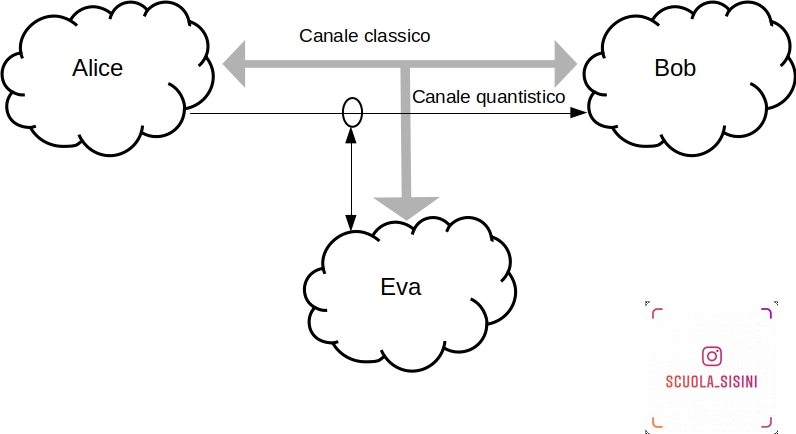

# Simulazione del Protocollo QKD (Quantum Key Distribution)

## Descrizione

Questo progetto implementa una simulazione del protocollo di distribuzione quantistica delle chiavi (QKD), specificamente la variante BB84. 

Il protocollo QKD è uno dei metodi più avanzati per garantire la distribuzione sicura delle chiavi crittografiche utilizzando le proprietà fondamentali della meccanica quantistica. Questo codice dimostra come due partecipanti, Alice e Bob, possano condividere una chiave segreta e rilevare eventuali intercettazioni grazie al comportamento quantistico dei fotoni.

### Scopo Didattico

L'obiettivo di questo progetto è fornire una comprensione pratica e intuitiva del protocollo QKD. Il programma permette di osservare come la scelta delle basi di misura e la polarizzazione dei fotoni influiscono sulla sicurezza della distribuzione della chiave.

## Requisiti

- `gcc` (GNU Compiler Collection)
- `make` (Strumento di automazione della compilazione)

## Istruzioni per l'uso

### Clonare il repository

Per clonare il repository, eseguire il seguente comando:

```bash
git clone https://github.com/francescosisini/qkd-simulation.git
cd qkd-simulation
```
Compilazione del programma

Per compilare il programma, utilizzare il comando make:

```bash

make
```
Questo comando compilerà il programma e genererà un file eseguibile chiamato qkd_simulation.
Esecuzione del programma

Per eseguire il programma, eseguire il seguente comando:

```bash

./qkd_simulation
```
Il programma simulerà lo scambio di fotoni tra Alice e Bob, visualizzando i risultati sul terminale. La simulazione include l'emissione dei fotoni, la scelta delle basi da parte di Alice e Bob, e la rivelazione delle polarizzazioni.
Pulizia del progetto

Per rimuovere i file oggetto e l'eseguibile, eseguire il comando:

```bash

make clean
```
Come funziona

Il programma simula i seguenti passaggi del protocollo QKD:

    Emissione dei fotoni: Alice invia fotoni polarizzati con basi casuali (Standard o Hadamard).
    Rivelazione: Bob riceve i fotoni e misura le loro polarizzazioni usando basi casuali.
    Comparazione delle basi: Alice e Bob comparano le basi utilizzate e scartano le misure effettuate con basi diverse.
    Generazione della chiave: Le misure rimanenti formano la chiave condivisa.

Grazie alle proprietà della meccanica quantistica, un eventuale intercettatore (Eve) che tenti di misurare i fotoni influenzerà le misurazioni, e questo potrà essere rilevato da Alice e Bob.
Esempi di Output

Ecco un esempio di output tipico del programma:


Contributi

Le pull request sono benvenute. Per cambiamenti importanti, ti preghiamo di aprire prima una issue per discutere di cosa vorresti cambiare.
Licenza

Questo progetto è rilasciato sotto la licenza GPL v3. Consulta il file LICENSE per maggiori dettagli.


